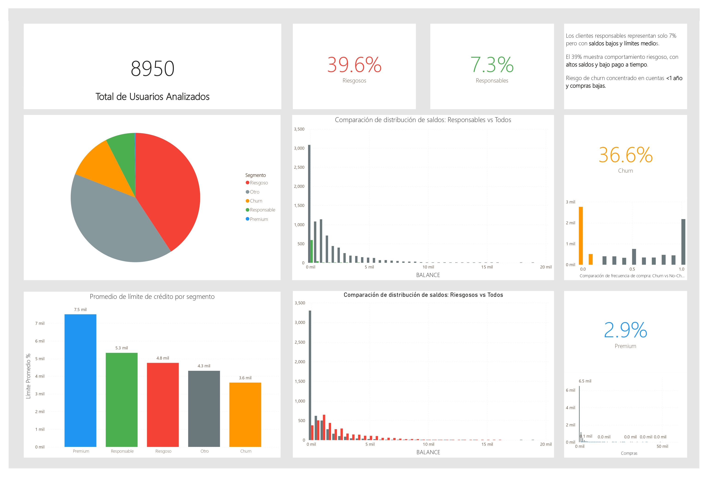

# Análisis Ejecutivo de Clientes de Tarjeta de Crédito

Este repositorio contiene un **análisis exploratorio de datos (EDA)** aplicado sobre un dataset público (Kaggle) simulando una cartera de usuarios de tarjeta de crédito. El objetivo es demostrar capacidad analítica y de visualización enfocada en **segmentación, riesgo y valor**.

## Objetivos

- Identificar segmentos clave de usuarios:
  - **Responsables**
  - **Riesgosos**
  - **Premium**
  - **Riesgo de Churn**
- Explorar patrones de comportamiento financiero:
  - Saldos
  - Límites de crédito
  - Frecuencia de compra
- Visualizar insights accionables para estrategias de negocio.

## Herramientas usadas

- Python (EDA en Jupyter/Colab)
- Power BI (dashboard interactivo)
- GitHub (documentación y versionado)

## Estructura del repositorio

```
/data
  cc_data.csv               # Dataset fuente
/notebooks
  Analisis_Tarjetas_Credito.ipynb  # Notebook con análisis exploratorio
/dashboards
  CreditCardEDA.pbix        # Archivo de dashboard Power BI
  dashboard_final.png       # Export de diseño final
README.md                   # Este documento
```

## Dashboard final



## Insights clave:

**Responsables:**\
Representan solo 7% de la cartera. Saldos bajos y límites medios. Buen comportamiento.

**Riesgosos:**\
39% de los usuarios muestran altos saldos, bajo pago y alto uso de cash advance.

**Churn Risk:**\
36% en riesgo de abandono, concentrados en cuentas < 1 año y compras bajas.

**Premium:**\
2.9% de usuarios con alto gasto (~\$4,300), siempre pago a tiempo, límites altos (~\$7,500).

---

## Cómo ejecutarlo

1️⃣ Clonar repo:

```bash
git clone https://github.com/andreslara/creditcard-analysis
```

2️⃣ Explorar notebook (`notebooks/Analisis_Tarjetas_Credito.ipynb`).

3️⃣ Abrir dashboard interactivo (`dashboards/CreditCardEDA.pbix`) en Power BI Desktop.

